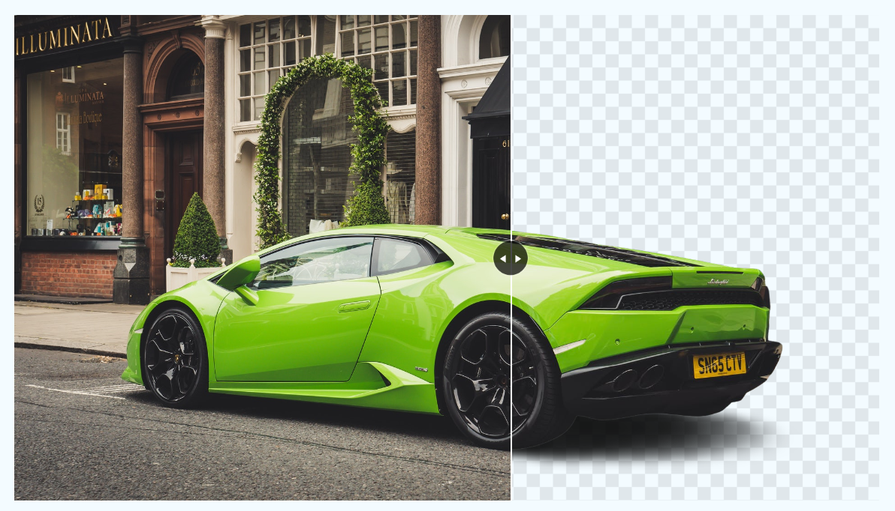

# <h1 align="center">Background Effect App</h1>

A simple web application that creates an interactive background effect with a resizable image.

## Features

- An image with a resizable width.
- Users can drag to resize the image.
- Interactive line and arrow indicate the image's width.

## Usage

1. Open the app in your web browser.

2. You will see an image with a resizable width.

3. Hover your mouse over the image, and you can drag to resize it.

4. As you resize the image, an interactive line and arrow will indicate the image's current width.

## Demo

  

