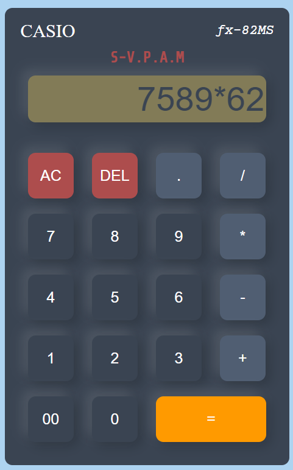

# <h1 align='center'>Calculator App</h1>

A simple web-based calculator application that allows you to perform basic arithmetic operations. You can add, subtract, multiply, and divide numbers with this user-friendly calculator.

## Features

- Perform addition, subtraction, multiplication, and division operations.
- Clear the input field.
- Delete the last character in the input field.
- Calculate and display the result.

## Usage

1. Open the app in your web browser.

2. Use the numeric buttons to input numbers.

3. Use the operator buttons (+, -, *, /) to select the desired operation.

4. To clear the input field, click the "AC" button.

5. To delete the last character in the input field, click the "DEL" button.

6. To calculate the result, click the "=" button.

7. The result will be displayed in the input field.

## Demo

  

