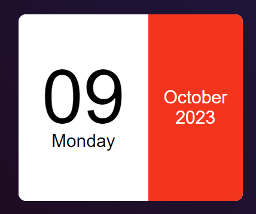

# <h1 align="center">Calendar App</h1>

A simple web application that displays the current date and time in a calendar format.

## Features

- Displays the current date, day, month, and year.
- Stylish and responsive user interface.

## Usage

1. Open the app in your web browser.

2. You will see the current date, day, month, and year displayed in a calendar format.

## Demo

  

