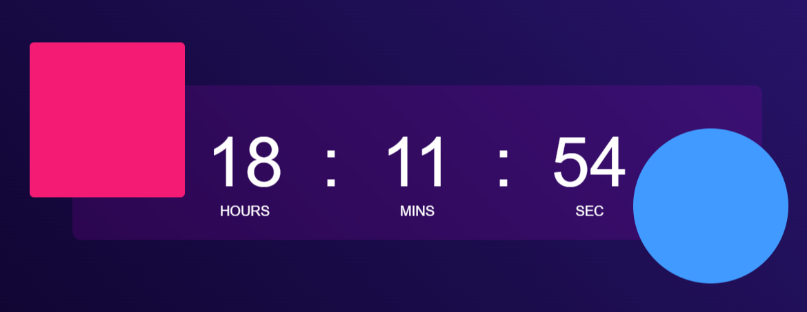

<h1 align="center">Digital Clock App</h1>

A simple web application that displays a digital clock on a stylish and animated background.

## Features

- Displays the current time in a digital format (hours, minutes, seconds).
- Stylish and animated background.
- Eye-catching design with gradient colors.

## Usage

1. Open the app in your web browser.

2. The digital clock will be displayed in the center of the screen on an animated background.

3. The clock will continuously update to show the current time.

## Demo

  

