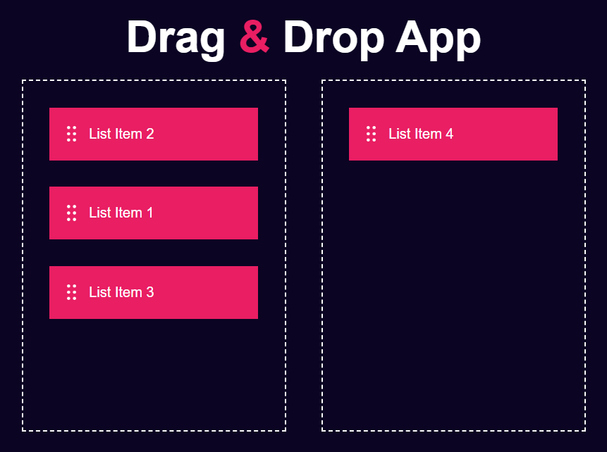

# <h1 align="center">Drag & Drop App</h1>

A simple web application that demonstrates drag and drop functionality.

## Usage

1. Open the app in your web browser.

2. You will see a list of items on the left side of the container, each with a drag-and-drop feature.

3. You can drag any of the items and drop them into the right container.

## Features

- Drag and drop items from the left container to the right container.

  

