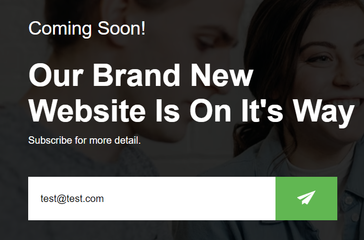
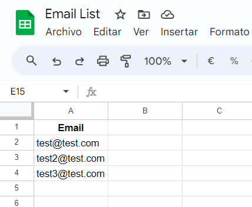

# <h1 align="center">Email Subscription App</h1>

A web application that allows users to subscribe to your brand new website and receive updates via email.

## Features

- User-friendly interface for email subscription.
- Real-time confirmation message upon successful subscription.
- Form validation to ensure a valid email address is provided.
- Emails are saved in a Google Sheet.

## Usage

1. Open the app in your web browser.

2. Enter your email address in the input field.

3. Click the "Send" button to subscribe.

4. A confirmation message will appear once the subscription is successful.

5. Change the scriptURL in the `script.js` file to your own Google Apps Script URL.

6. Follow this [repository](https://github.com/jamiewilson/form-to-google-sheets) to get step by step for setting up Google Apps Script.

## Demo

  
  

