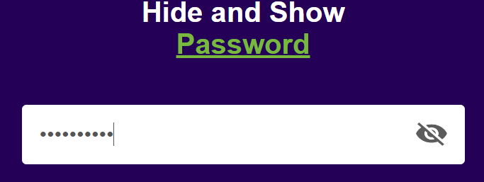

# <h1 align='center'>Hide n' Show App</h1>

A simple web application that allows users to toggle the visibility of a password field. Users can hide or show the password they enter in the input field.

## Features

- Toggle the visibility of the password.
- Clean and user-friendly interface.

## Usage

1. Open the app in your web browser.

2. Enter your password in the input field.

3. Click the eye icon to toggle the visibility of the password.

## Demo

  
  

