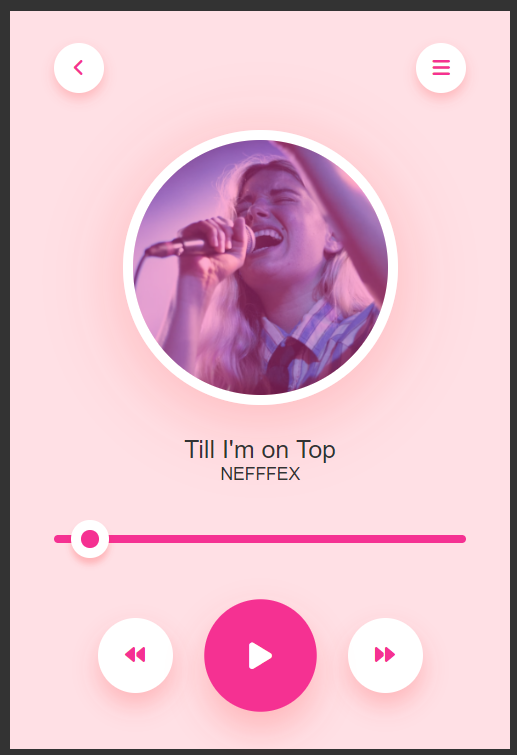

# <h1 align='center'>Music Player App</h1>

A simple web-based music player application that allows you to play your favorite music tracks. You can control playback, adjust the volume, and enjoy your music collection with this user-friendly app.

## Features

- Play and pause your music.
- Clean and intuitive user interface.

## Usage

1. Open the app in your web browser.

2. Load your music collection into the app.

3. Enjoy your music seamlessly with this easy-to-use music player.

## Demo

  

Song used: Till I'm on Top - NEFFEX (download from YouTube studio audio library)
