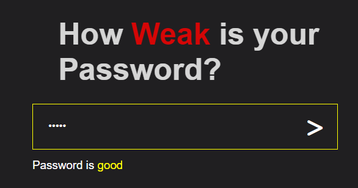

# <h1 align="center">Password Strength App</h1>

A simple web application that assesses the strength of a password and provides real-time feedback to help users create stronger passwords.

## Features

- Password strength assessment (Weak, Good, Strong).
- Real-time feedback on password strength.
- Stylish and responsive user interface.

## Usage

1. Open the app in your web browser.

2. Enter your password in the input field.

3. As you type, the app will assess the password strength and display feedback:
   - **Weak:** Less than 5 characters.
   - **Good:** 5 to 7 characters.
   - **Strong:** 8 or more characters.

4. The color of the input border and the displayed message will change according to the password strength.

## Demo

  

