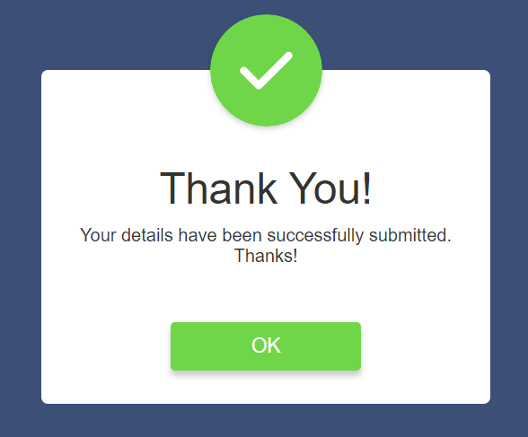

# <h1 align='center'>Popup App</h1>

A simple web-based popup application that displays a message when the "Submit" button is clicked. This app demonstrates how to create a popup and use transitions for a smooth user experience.

## Features

- Displays a popup message when the "Submit" button is clicked.
- Allows users to close the popup by clicking the "OK" button.
- The popup message has a transition from top to center.

## Usage

1. Open the app in your web browser.

2. Click the "Submit" button.

3. The popup message will appear with a transition effect.

4. To close the popup, click the "OK" button.

## Demo

  

