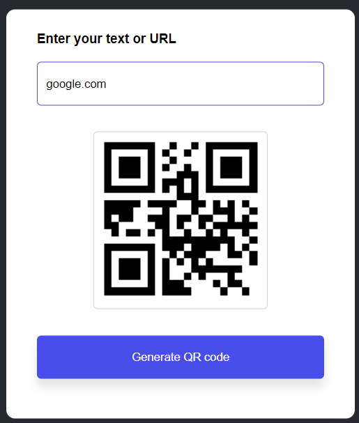

<h1 align='center'>QR Code Generator App</h1>

A simple web application that allows you to generate QR codes from text or URLs. You can enter the text or URL, click the "Generate QR code" button, and the app will display the QR code image.

## Features

- Generate QR codes from text or URLs.
- Responsive design for various screen sizes.
- Error animation for invalid input.
- Clean and user-friendly interface.

## Usage

1. Open the app in your web browser.

2. Enter the text or URL you want to encode into a QR code in the input field.

3. Click the "Generate QR code" button.

4. The QR code image will be displayed below the input field.

5. You can save or share the generated QR code as needed.

## QR Code Generator App Screenshot

  

