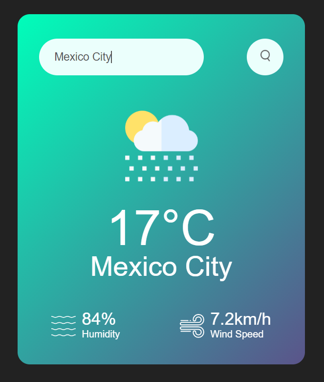

# <h1 align="center">JavaScript HTML CSS Practices</h1>

## Weather App

A simple web application to check the weather for a specific city.

## Features

- Enter a city name to get the current weather information.
- Display of temperature in Celsius.
- Display of humidity percentage.
- Display of wind speed in kilometers per hour.
- Weather icon representation based on current conditions.

## Demo

