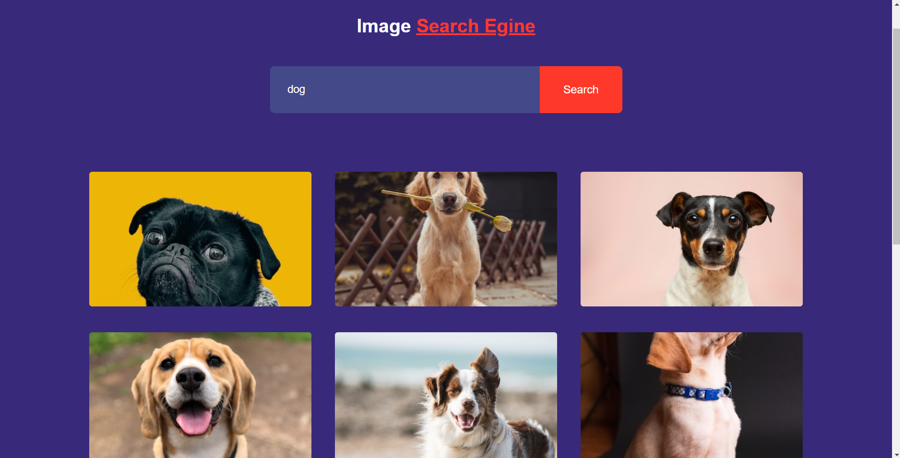

# <h1 align="center">Search Engine App</h1>

A simple web application that allows you to search for images. You can enter keywords, and the app will display images related to your search query.

## Features

- Search for images by entering keywords.
- Display search results in a grid of images.
- Load more search results with the "Show more" button.

## API
- Create an account.
- The used API was from [Unsplash](https://unsplash.com/).
- Create an account, use the developer API and you will need the access key.

## Usage

1. Open the app in your web browser.

2. Type your search query in the input box.

3. Click the "Search" button to see search results.

4. Click the "Show more" button to load additional search results.

## Demo

  

