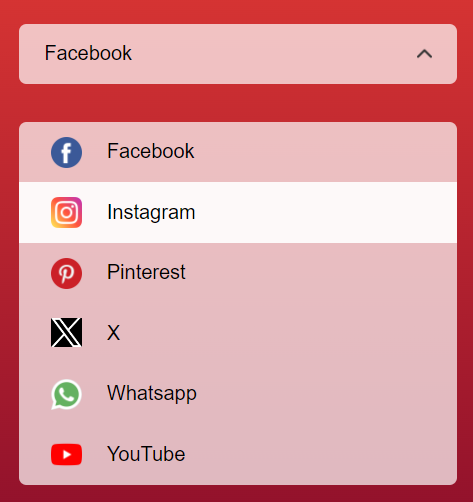

# Select Menu App

A simple web application that allows users to select a social media platform from a dropdown menu.

## Features

- Dropdown menu with social media options.
- Stylish and responsive user interface.
- Option selection with immediate display.

## Usage

1. Open the app in your web browser.

2. Click on the "Select Social Media" field to open the dropdown menu.

3. Choose a social media platform from the list by clicking on it.

4. The selected platform will be displayed in the "Select Social Media" field.

## Demo

  

