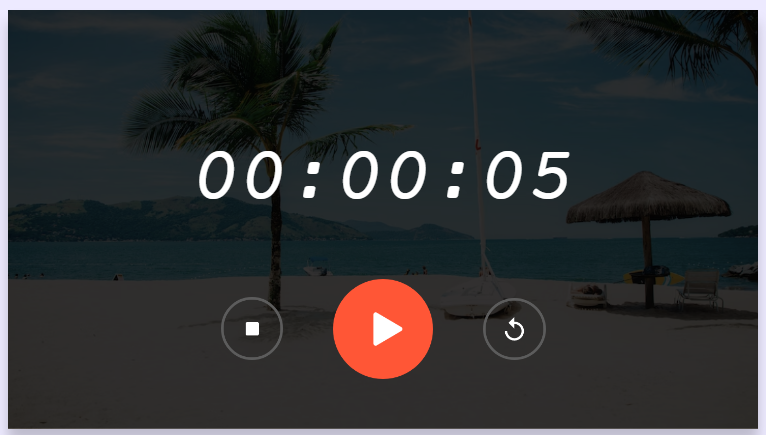

# <h1 align='center'>Stopwatch Application</h1>

A simple web-based stopwatch application that allows you to measure elapsed time precisely. You can start, stop, and reset the stopwatch to track time as needed.

## Features

- Start the stopwatch to measure elapsed time.
- Stop the stopwatch to pause time tracking.
- Reset the stopwatch to zero.

## Usage

1. Open the app in your web browser.

2. Click the "Start" button to begin measuring time.

3. Click the "Stop" button to pause the stopwatch.

4. Click the "Reset" button to set the stopwatch back to zero.

5. The displayed time format is in hours:minutes:seconds.

## Demo

  

