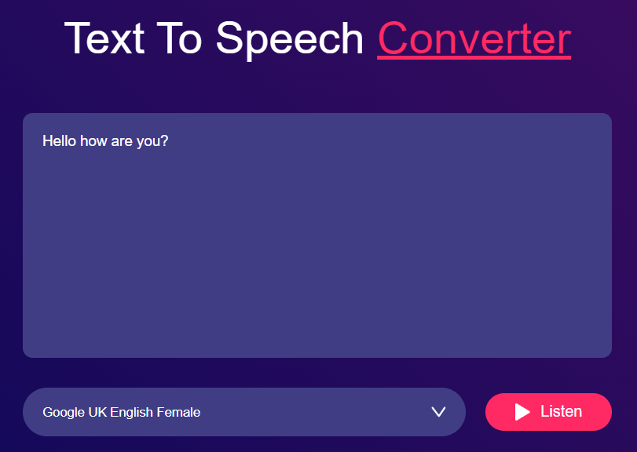

# <h1 align="center">Text to Voice App</h1>

A simple web application that converts text input into speech using text-to-speech technology, providing users with audio playback of their text content.

## Features

- Convert written text into speech.
- Select different voices for speech synthesis.
- Stylish and user-friendly interface.

## Usage

1. Open the app in your web browser.

2. Enter the text you want to convert into the textarea provided.

3. Choose a voice from the dropdown menu to select the speech synthesis voice.

4. Click the "Listen" button to convert the text into speech.

## Demo

  

