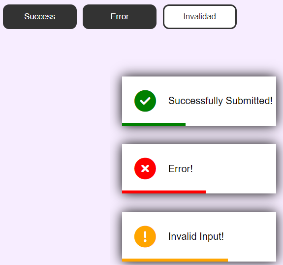

<h1 align='center'>Toast Notification App</h1>

A web application that allows you to display toast notifications for success, error, and invalid input messages. These notifications provide quick feedback to the user and automatically disappear after a few seconds.

## Features

- Display success notifications.
- Show error notifications.
- Provide notifications for invalid input.
- Automatic removal of notifications after a set duration.
- Simple and responsive design.

## Usage

1. Open the app in your web browser.

2. Use the provided buttons to trigger different types of notifications.

3. Toast notifications will appear at the bottom-right corner of the screen.

4. Success notifications are displayed with a green checkmark icon.

5. Error notifications are displayed with a red X icon.

6. Invalid input notifications are displayed with an orange exclamation mark icon.

7. Notifications automatically disappear after a few seconds.

## Demo

  

